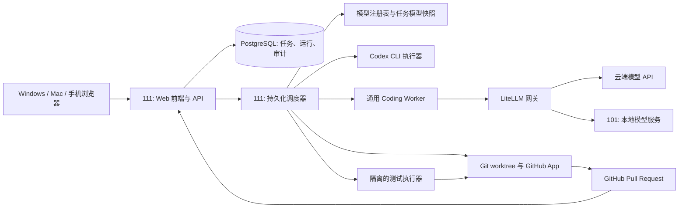

# MultiAgent 多 Agent Coding 环境设计方案

> 版本：2026-09-26。111 的配置已确认：12 核 CPU、12GB 内存、500GB 硬盘。Web 页面端口固定为 **33080**。首个可运行版本已部署到 111；本文件同时保留后续完整架构目标。

## 1. 目标与边界

- 以 Coding 为首要场景，网页创建和管理任务，可从 Windows、MacBook、外网手机访问。
- 规划、实现、测试、Review 四种 Agent 的模型在**创建任务时分别指定**；不同 Agent、不同子任务可使用不同提供商。
- 同时接入云端 API、本地推理服务，以及用户 ChatGPT Plus 登录的 Codex CLI。
- 111 Linux 服务器 7×24 小时运行入口和调度；101 主机 7×24 小时提供本地算力。
- GitHub 是远程代码仓库及 Pull Request 交付目标。任务入口、进度、日志、差异和验收都在本项目 Web 应用中；不依赖 Gitea。
- 后续通过增加 Worker 类型支持图像生成、视频剪辑和视频生成。

## 2. 总体架构

**控制面放在 111**：Web、调度、数据库、模型网关和任务状态持续运行。**算力面放在 101**：优先运行本地模型推理，后续承接 GPU 图像和视频任务；若需在 101 跑构建/测试，可增设 WSL2 Worker。111 无 GPU，不承担本地大模型推理。

## 3. Web 应用与任务界面

完整版本建议采用 React + TypeScript 前端、FastAPI 后端、PostgreSQL 状态库。首个可运行版本先使用 Python 标准库 Web 服务、原生 JavaScript 和 SQLite，减少 111 的部署依赖；API 和状态机稳定后再替换界面和数据库。Web 端口为 33080。移动端优先提供任务创建、进度、日志、diff、PR 链接及暂停/恢复/验收操作。网页是唯一的任务操作入口；GitHub 页面仅作为代码仓库和 PR 的补充视图。

创建任务表单至少包含：

| 字段 | 说明 |
|---|---|
| GitHub 仓库与基线分支 | 从授权仓库中选择；调度器基于该分支创建任务分支。 |
| 需求与验收条件 | 支持文本、相关文件路径和测试命令；验收条件应可检查。 |
| 规划 Agent 模型 | 独立选择 Codex、云端 API 或本地模型。 |
| 实现 Agent 模型 | 独立选择；规划拆出的子任务可单独覆盖模型。 |
| 测试 Agent 模型 | 用于补测试、分析失败和提出修复；实际测试命令由隔离执行器运行。 |
| Review Agent 模型 | 独立于实现模型选择；审查代码差异与验收条件。 |
| 执行参数 | 任务预算、最大步骤数、重试上限、超时、并发策略，以及是否允许自动创建 PR。 |

模型选择器显示提供商、模型名称、云端/本地、可用状态、适用角色、预估成本等级及能力提示。提交任务时将所选模型的**实际标识和配置版本保存为快照**；管理员后来修改默认模型，不应悄悄改变运行中任务。若选中模型不支持所需工具调用、上下文长度或代码编辑方式，表单应提示并阻止启动。模型不可用时暂停任务并提示选择备用模型，不能未经用户设定自动换成可能更贵的模型。

可保存“默认配置模板”以便快速发起任务，但四个角色始终可以逐项改选。初始建议：旗舰模型规划、低成本云端或 101 本地模型实现、适合写测试的模型做测试 Agent、Codex 或其他旗舰模型做 Review；这些只是默认值，不是固定路由。

## 4. Agent 执行与验收流程

1. Web 创建任务，校验仓库权限、模型可用性、预算及测试配置。
2. 规划 Agent 输出结构化任务计划、子任务依赖、验收条件和潜在风险。用户可在网页修改或批准计划。
3. 每个实现子任务获取独立 Git worktree、分支和受限执行环境。可为不同子任务指定不同模型/提供商；调度器控制依赖和合并顺序，避免并行写同一工作区。
4. 测试 Agent 依据验收条件编写或改进测试、解释失败。构建、lint、单元测试和集成测试由确定性的测试执行器运行，保留命令、退出码和日志。失败反馈给对应实现 Agent，达到重试上限即暂停并报告。
5. Review Agent 阅读基线与最终差异、测试结果及任务要求，输出必须修复的问题和验收结论。Review 与实现应使用独立会话；可选择不同模型。
6. 通过门禁后推送任务分支并创建 GitHub PR；Web 页面展示 PR、diff、测试和评审结果。默认由用户决定合并，不自动合并主分支。

调度状态至少包括 `queued`、`planning`、`awaiting_plan_approval`、`implementing`、`testing`、`reviewing`、`awaiting_user_acceptance`、`completed`、`failed`、`paused`。数据库保存检查点、每轮模型调用与工具事件、Git commit、成本/用量、失败原因。服务重启后从检查点恢复，避免重复执行已经完成的代码写入或 PR 创建。

## 5. 模型接入与 Codex Plus

### 通用模型适配器

LiteLLM 统一管理有正式 API 的云端模型和本地 OpenAI 兼容接口；每个已登记模型必须有唯一 ID、提供商、地址、能力标记、上下文限制、并发上限、超时和成本配置。101 已有本地模型接口记录，可作为首个接入目标。Ollama、llama.cpp、vLLM、LM Studio 可按各自协议接入；不要假定每个本地模型都适合执行工具调用和复杂 Coding 任务，需以试运行结果决定可选角色。

### Codex 执行器

Codex 走单独的 CLI 适配器，**不经过 LiteLLM，也不把 ChatGPT Plus 当作通用 API Key**。在 111 上为专用系统账户完成 Codex 登录；调度器在受限工作区调用 `codex exec --json` 执行任务，使用 `codex exec review` 审查代码，并把事件、结果和退出状态回传 Web 应用。当前本机 Codex CLI 已确认具备这些无界面命令及设备登录选项；部署时仍须验证服务器上的版本、登录保持、并发限制与订阅可用性。

Codex 凭据仅供专用执行器读取，不进入 Web 数据库、任务提示词或其他 Worker 容器。设置并发上限和超时；遇到额度、认证或服务问题时暂停任务，按任务预先选择的备用模型继续，或等待用户处理。ChatGPT Plus 的具体额度及可用方式应以部署时的官方 OpenAI Docs 为准；本方案不承诺无限量或固定吞吐。云端 API 仍独立计费。

## 6. GitHub 集成

- GitHub 是唯一规定的远程代码仓库；支持从 Web 应用选择授权仓库、读取默认分支、创建任务分支、推送提交和创建/更新 PR。
- 建议使用安装在指定仓库的 GitHub App，授予完成仓库读取、内容写入、PR 操作所需的最小权限，并使用短期安装令牌。个人试运行阶段也可使用限于指定仓库的 fine-grained PAT，正式部署再切换。
- 任务分支名包含任务 ID；记录基线 commit，创建 PR 前重新检查是否需要同步基线。PR 标题与说明包含目标、改动摘要、测试结果、模型评审结论及 Web 任务链接，不包含密钥或完整私有日志。
- GitHub Actions 可作为远端 CI 门禁；本地测试执行器负责快速反馈。若两个结果冲突，以失败状态阻止自动验收。
- 仓库中可能有不可信指令，Agent 应把仓库文件视为任务资料，不应据此扩大凭据、网络或主机权限。

## 7. 部署、资源与访问

| 节点 | 首版部署 | 资源约束 |
|---|---|---|
| 111：12C / 12GB / 500GB | Web/API、PostgreSQL、调度器、LiteLLM、Codex 执行器、轻量 Coding/测试容器 | 已有其他服务；初始仅允许运行 1～2 个代码任务，按实际内存和 I/O 调整。数据库、日志和工作区设置配额与清理策略。 |
| 101：R9 9950X / 48GB RAM / RTX 5060 Ti 16GB | 本地模型服务；以后可增加 WSL2 GPU Worker、图像/视频队列 | 本地模型和媒体任务共享显存，须限制并发；视频生成能力以实际模型与显存测试为准。确保开机、服务和 WSL2 自动恢复。 |

远程访问首选 Tailscale：111、Windows、Mac 和手机加入同一私有网络，直接通过浏览器使用 Web 应用。若需不安装客户端的公网网页，再通过现有 NAS 反向代理发布 HTTPS 域名，并加独立身份认证、双因素认证和访问日志。模型接口、数据库、Agent 容器与宿主终端只对内网开放。

代码执行环境使用独立账户、容器或受限沙箱；禁止挂载宿主 Docker Socket 和生产环境密钥。GitHub、云端模型及 Codex 凭据分别管理。对每个任务限制 CPU、内存、磁盘、时长、并发、网络权限和重试次数；为 PostgreSQL 与任务元数据做定期备份。

## 8. 实施阶段与验收标准

1. **单任务闭环**：Web 创建任务、选择四个角色模型；Codex 和至少一个云端/101 本地模型可被调度；完成修改、确定性测试、Review，并创建 GitHub PR。手机能查看状态和 diff。
2. **可靠性与多 Agent**：加入子任务依赖、独立 worktree、失败恢复、预算与用量、模型备用方案、任务暂停/继续；断电或服务重启后不重复推送或创建 PR。
3. **GPU 与媒体扩展**：101 加入受控 Worker 队列，再按任务类型增加图像、视频工具和专用验收流程。

首版通过的实际标准：从手机或电脑网页提交一个真实仓库任务，分别指定四个角色的模型，任务在无人值守条件下产出可审查的 GitHub PR；Web 页面能回溯计划、各 Agent 的模型、代码差异、测试证据、Review 意见和异常原因。

## 9. 部署前需要确认的配置

- 111 可供新服务使用的剩余内存与磁盘，以及 33080 端口是否空闲。
- 101 当前本地模型服务的启动方式、开机恢复方式及可稳定并发数。
- 首批接入的 GitHub 仓库、测试命令、允许 Agent 修改的路径和 PR 分支策略。
- 默认的四角色模型模板、每任务预算和 Codex 无法使用时的处理方式。

## 10. 首版实施记录（2026-09-26）

- 111 已运行单进程 Web/API/Worker，监听 Tailscale 地址的 33080；使用独立网页密码和 SQLite。当前电脑已跨设备验证健康接口。
- GitHub SSH 已验证可访问首个仓库 `yuan-xin-9997/PolicyAnalysisSystem`；真实仓库的临时规划任务已进入 `awaiting_plan_approval`，未写入仓库或创建 PR。
- 101 的模型接口可从 111 访问，模型 `Qwen3.8-27B-GSQ-RCO-IQ3_XXS` 已加入规划、实现、测试和 Review 的相应选择器。Aider 容器使用本地模型完成过临时文件编辑；隔离测试镜像运行通过该仓库的一个 smoke test。
- Codex CLI 已安装且显示 ChatGPT 登录，但 111 到 ChatGPT/OpenAI 的直连和现有 NAS 代理均超时。网页暂时禁用 Codex 选择；网络修复并通过非交互烟测后才能重新启用。
- GitHub PR API 授权尚未配置。SSH 可推送分支；网页验收后会显示 GitHub 比较页面供手动创建 PR。配置 API 授权后可由系统直接创建 PR。
- 首版尚未实现设计中的 PostgreSQL、多 Worker 并行、预算控制、任务中途安全续跑和图像/视频 Worker；以 README 的“目前限制”为准。
